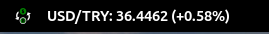
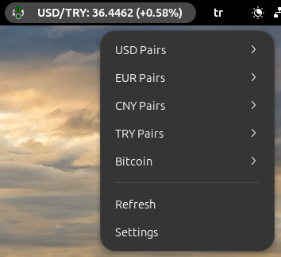

# Currency Tracker — GNOME Shell Extension


A GNOME Shell extension that tracks real-time currency and cryptocurrency rates directly in your panel. Supports a wide range of fiat pairs, major cryptocurrencies, Argentine Dollar types, and any custom coin from CoinGecko.




## Features

### Core
- Real-time rates for 70+ built-in currency pairs
- Organized menu with 6 categories (USD Pairs, EUR Pairs, GBP Pairs, Other Fiat, Crypto, ARS Dolar)
- Configurable refresh interval (30–3600 seconds)
- Supports light and dark GNOME themes

### Display
- **Percentage Change**: Colored up/down arrows (green ↑ / red ↓) in the panel
- **Sparkline Chart**: 24-hour price trend chart in the popup menu
- **Decimal Places**: Configurable precision (2–4 decimal places)
- **Panel Icon**: Toggle the currency icon on/off

### Reliability
- **Smart Caching**: Shows cached data with age when network is unavailable
- **Rate Limiting**: Minimum 10 seconds between manual refreshes
- **Retry with Backoff**: Automatic retry on failure (1 s → 2 s → 4 s)
- **Price Alerts**: Notifications when a rate crosses your threshold (above or below)

### Custom Coin
- Track **any CoinGecko coin** not in the built-in list
- Configure coin ID, display symbol, and quote currency in Preferences
- Menu updates automatically when settings change

### Developer
- **Debug Logging**: Detailed logs via `journalctl -f -o cat /usr/bin/gnome-shell`

---

## Supported Pairs

### Fiat (via [awesomeapi](https://economia.awesomeapi.com.br))

| Category | Pairs |
|----------|-------|
| **USD Pairs** | USD/EUR, USD/GBP, USD/JPY, USD/CNY, USD/TRY, USD/CAD, USD/AUD, USD/CHF, USD/MXN, USD/KRW, USD/ARS, USD/BRL, USD/SEK, USD/NOK, USD/DKK, USD/ZAR, USD/RUB, USD/INR, USD/ILS, USD/SGD |
| **EUR Pairs** | EUR/USD, EUR/GBP, EUR/JPY, EUR/CNY, EUR/TRY, EUR/CAD, EUR/AUD, EUR/CHF, EUR/MXN, EUR/KRW, EUR/ARS, EUR/BRL, EUR/SEK, EUR/NOK, EUR/DKK, EUR/ZAR, EUR/RUB, EUR/INR, EUR/ILS, EUR/SGD |
| **GBP Pairs** | GBP/USD, GBP/EUR, GBP/JPY, GBP/CNY, GBP/TRY |
| **Other Fiat** | JPY/USD, JPY/EUR, CNY/USD, CNY/EUR, TRY/USD, TRY/EUR, MXN/USD, MXN/EUR |

### Crypto (via [CoinGecko](https://www.coingecko.com))

| Coin | Pairs |
|------|-------|
| **Bitcoin (BTC)** | BTC/USD, BTC/EUR, BTC/GBP, BTC/JPY, BTC/TRY |
| **Ethereum (ETH)** | ETH/USD, ETH/EUR |
| **Kaspa (KAS)** | KAS/USD, KAS/EUR, KAS/TRY |

### Argentine Dollar (via [dolarapi.com](https://dolarapi.com))

USD/ARS Official, Blue, Bolsa, CCL, Tarjeta, Cripto, Mayorista

---

## Requirements

- GNOME Shell 45 or later
- Internet connection

---

## Installation

### From GNOME Extensions Website
1. Visit [Currency Tracker on GNOME Extensions](https://extensions.gnome.org/extension/7862/currency-tracker/)
2. Click the toggle to install

### Manual Installation
```bash
git clone https://github.com/faymaz/currency-tracker.git
cp -r currency-tracker ~/.local/share/gnome-shell/extensions/currency-tracker@faymaz.github.com
```
Then restart GNOME Shell (`Alt+F2` → type `r` → Enter) and enable the extension.

---

## Configuration

Open **Settings** from the extension menu (click the panel label → Settings).

### General Settings
| Option | Description |
|--------|-------------|
| Default Currency Pair | The pair shown on first launch |
| Refresh Interval | Seconds between automatic updates (30–3600) |

### Display Settings
| Option | Description |
|--------|-------------|
| Show Percentage Change | Colored ↑/↓ indicator in the panel |
| Show Icon | Toggle the panel icon |
| Show Sparkline Chart | 24-hour mini price chart in popup |
| Decimal Places | Precision of displayed rates (2–4) |

### Notification Settings
| Option | Description |
|--------|-------------|
| Enable Notifications | Turn on price alert notifications |
| Notification Threshold | Rate value to trigger the alert |
| Notification Type | Alert when rate goes **above** or **below** threshold |

### Custom Coin (CoinGecko)
Track any coin not in the built-in list:

| Option | Description | Example |
|--------|-------------|---------|
| CoinGecko Coin ID | The coin's ID on CoinGecko | `dogecoin`, `solana`, `pepe` |
| Display Symbol | Label shown in panel and menu | `DOGE`, `SOL`, `PEPE` |
| Quote Currency | Currency to price against | USD, EUR, TRY, GBP |

> **Finding a Coin ID**: Go to `coingecko.com`, search for the coin, and copy the last part of the URL.
> Example: `coingecko.com/en/coins/dogecoin` → Coin ID is `dogecoin`

After saving, a **Custom Coin** entry appears in the menu automatically — no restart needed.

### Advanced Settings
| Option | Description |
|--------|-------------|
| Enable Debug Logging | Verbose logs for troubleshooting |

View debug logs:
```bash
journalctl -f -o cat /usr/bin/gnome-shell
```

---

## Data Sources

| Source | Used for |
|--------|----------|
| [awesomeapi](https://economia.awesomeapi.com.br) | All fiat pairs and BTC/ETH |
| [CoinGecko](https://api.coingecko.com) | Kaspa (KAS) and custom coins |
| [dolarapi.com](https://dolarapi.com) | Argentine Dollar types |

---

## Contributing

Contributions are welcome! Please open an issue or submit a Pull Request on [GitHub](https://github.com/faymaz/currency-tracker).

## License

GPL-3.0 — see [LICENSE](LICENSE) for details.
