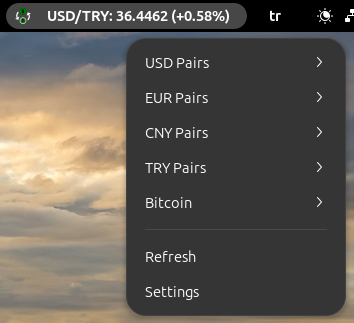

# Currency Tracker GNOME Extension


A GNOME Shell extension that allows you to track various currency pairs and cryptocurrency rates in real-time.




## Features

- Track multiple currency pairs including USD, EUR, GBP, CNY, and TRY
- Bitcoin price tracking in multiple currencies
- Real-time updates with configurable refresh intervals
- Customizable display options
- Support for both light and dark GNOME themes
- Simple and intuitive interface

## Requirements

- GNOME Shell 45 or later
- Internet connection for real-time currency updates

## Installation

### From GNOME Extensions Website
1. Visit [Currency Tracker on GNOME Extensions](https://extensions.gnome.org/extension/currency-tracker)
2. Click on the toggle switch to install

### Manual Installation
1. Clone this repository:
```bash
git clone https://github.com/faymaz/currency-tracker.git
```

2. Copy the extension to GNOME extensions directory:
```bash
cp -r currency-tracker ~/.local/share/gnome-shell/extensions/currency-tracker@faymaz.github.com
```

3. Restart GNOME Shell:
   - Press Alt+F2
   - Type 'r' and press Enter

4. Enable the extension using GNOME Extensions app or GNOME Tweaks

## Configuration

1. Click on the extension icon in the top panel
2. Select "Settings" from the menu
3. Adjust the following options:
   - Default currency pair
   - Refresh interval (30-3600 seconds)
   - Show/hide percentage changes
   - Show/hide currency icon

## Supported Currency Pairs

### Fiat Currencies
- USD/EUR, USD/GBP, USD/CNY, USD/TRY
- EUR/USD, EUR/GBP, EUR/CNY, EUR/TRY
- GBP/TRY, GBP/CNY
- CNY/EUR, CNY/USD

### Cryptocurrencies
- BTC/USD
- BTC/EUR

## Contributing

Contributions are welcome! Please feel free to submit a Pull Request.

## License

This project is licensed under the GPL-3.0 License - see the [LICENSE](LICENSE) file for details.

---

# Para Birimi Takip GNOME Eklentisi

GNOME Shell için gerçek zamanlı döviz kurları ve kripto para birimlerini takip etmenizi sağlayan bir eklenti.

## Özellikler

- USD, EUR, GBP, CNY ve TRY dahil birden fazla para birimi çiftini takip etme
- Birden fazla para biriminde Bitcoin fiyat takibi
- Ayarlanabilir yenileme aralıkları ile gerçek zamanlı güncellemeler
- Özelleştirilebilir görüntüleme seçenekleri
- Hem açık hem koyu GNOME temaları için destek
- Basit ve sezgisel arayüz

## Gereksinimler

- GNOME Shell 45 veya üzeri
- Gerçek zamanlı döviz güncellemeleri için internet bağlantısı

## Kurulum

### GNOME Eklentiler Websitesinden
1. [GNOME Eklentiler'de Currency Tracker](https://extensions.gnome.org/extension/currency-tracker) sayfasını ziyaret edin
2. Kurulum için açma/kapama düğmesine tıklayın

### Manuel Kurulum
1. Bu depoyu klonlayın:
```bash
git clone https://github.com/faymaz/currency-tracker.git
```

2. Eklentiyi GNOME eklentiler dizinine kopyalayın:
```bash
cp -r currency-tracker ~/.local/share/gnome-shell/extensions/currency-tracker@faymaz.github.com
```

3. GNOME Shell'i yeniden başlatın:
   - Alt+F2 tuşlarına basın
   - 'r' yazın ve Enter'a basın

4. Eklentiyi GNOME Eklentiler uygulaması veya GNOME Tweaks ile etkinleştirin

## Yapılandırma

1. Üst paneldeki eklenti simgesine tıklayın
2. Menüden "Ayarlar"ı seçin
3. Aşağıdaki seçenekleri ayarlayın:
   - Varsayılan para birimi çifti
   - Yenileme aralığı (30-3600 saniye)
   - Yüzde değişimlerini göster/gizle
   - Para birimi simgesini göster/gizle

## Desteklenen Para Birimi Çiftleri

### Fiat Para Birimleri
- USD/EUR, USD/GBP, USD/CNY, USD/TRY
- EUR/USD, EUR/GBP, EUR/CNY, EUR/TRY
- GBP/TRY, GBP/CNY
- CNY/EUR, CNY/USD

### Kripto Para Birimleri
- BTC/USD
- BTC/EUR

## Katkıda Bulunma

Katkılarınızı bekliyoruz! Lütfen Pull Request göndermekten çekinmeyin.

## Lisans

Bu proje GPL-3.0 Lisansı ile lisanslanmıştır - detaylar için [LICENSE](LICENSE) dosyasına bakın.